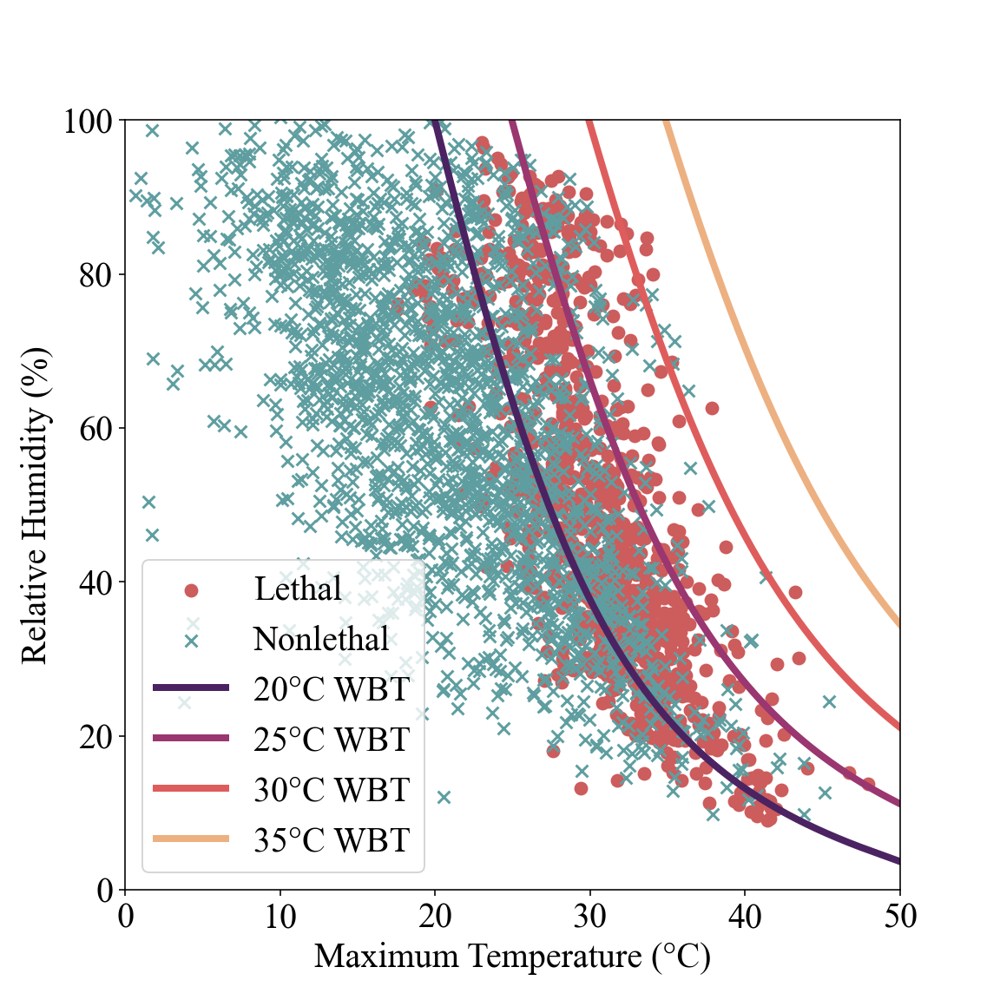

# lethal-heat

<a name="readme-top"></a>


<!-- PROJECT SHIELDS -->
[![Contributors][contributors-shield]][contributors-url]
[![Forks][forks-shield]][forks-url]
[![Stargazers][stars-shield]][stars-url]
[![Issues][issues-shield]][issues-url]
[![MIT License][license-shield]][license-url]


<!-- PROJECT HEADER -->
<p align="center">

</p>
<br />
<div align="center">
    <a href="https://github.com/robert-edwin-rouse/reclassifying-lethal-heat/issues">Report Bug</a>
    ·
    <a href="https://github.com/robert-edwin-rouse/reclassifying-lethal-heat/issues">Request Feature</a>
</div>

<p align="right">(<a href="#readme-top">back to top</a>)</p>

### Prerequisites

The project requires Python 3.8+, and various libraries described in the
[requirements.txt](https://github.com/robert-edwin-rouse/reclassifying-lethal-heat/blob/main/requirements.txt)
file.

### Installation and Running

1. Clone the repository:
```sh
git clone https://github.com/robert-edwin-rouse/reclassifying-lethal-heat.git
cd lethal-heat
```

2. Update the submodules:
```sh
git submodule update --init --recursive
```

3. Install the dependencies. We recommend doing this from within a virtual environment, e.g.
```sh
python3 -m venv venv
source venv/bin/activate
pip install -r requirements.txt
```
(If you do not wish to use a virtual environment then just the last step can be used to install the dependencies globally).

4. Download data and add it to the data folder from the following links, amending the configuration file as necessary with your email address and the names of downloaded datasets:
* [UN World Population Prospects 2024 data](https://population.un.org/wpp/)
* [Global Burden of Disease Study 2021 (GBD 2021) Socio-Demographic Index (SDI) data](https://ghdx.healthdata.org/record/global-burden-disease-study-2021-gbd-2021-socio-demographic-index-sdi-1950%E2%80%932021) 
* [NCD Risk Factor Collaboration BMI data](https://doi.org/10.5281/zenodo.10534960)

5. Run the script to compile the lethal heat database and pre-process all of the data:
```sh
python3 compiler.py
```

6. Running the following scripts will generate all of the results from the accompanying paper, in the order of the model validation from the appendix, the main results for classifying lethal heatwaves, the ablation and feature permutation study, and, finally, the greedy algorithm including the comparison for just wet bulb temperature variables and without them entirely:
```sh
python3 validation.py
python3 rfmodel.py
python3 sensitivityanalysis.py
python3 greedyforestbuilder.py
```

Once the model has been trained, a new input dataframe, using compiler.py and then turned into dataframe of the same format using the LethalHeatClassifier class, can be fed into the model by using the LethalHeatClassifier.predict() method to create predictions for future events.

<p align="right">(<a href="#readme-top">back to top</a>)</p>


<!-- CONTRIBUTING -->
## Contributing

Contributions are welcome.

<p align="right">(<a href="#readme-top">back to top</a>)</p>


<!-- LICENSE -->
## License

Distributed under the MIT License. See `LICENSE.txt` for more information.

<p align="right">(<a href="#readme-top">back to top</a>)</p>


<!-- ACKNOWLEDGMENTS -->
## Acknowledgments

* This project received support from Schmidt Sciences, LLC via the [Institute of Computing for Climate Science](https://iccs.cam.ac.uk/)

<p align="right">(<a href="#readme-top">back to top</a>)</p>


<!-- MARKDOWN LINKS & IMAGES -->
<!-- https://www.markdownguide.org/basic-syntax/#reference-style-links -->
[contributors-shield]: https://img.shields.io/github/contributors/robert-edwin-rouse/reclassifying-lethal-heat.svg?style=for-the-badge
[contributors-url]: https://github.com/robert-edwin-rouse/reclassifying-lethal-heat/graphs/contributors
[forks-shield]: https://img.shields.io/github/forks/robert-edwin-rouse/reclassifying-lethal-heat.svg?style=for-the-badge
[forks-url]: https://github.com/robert-edwin-rouse/reclassifying-lethal-heat/network/members
[stars-shield]: https://img.shields.io/github/stars/robert-edwin-rouse/reclassifying-lethal-heat.svg?style=for-the-badge
[stars-url]: https://github.com/robert-edwin-rouse/reclassifying-lethal-heat/stargazers
[issues-shield]: https://img.shields.io/github/issues/robert-edwin-rouse/reclassifying-lethal-heat.svg?style=for-the-badge
[issues-url]: https://github.com/robert-edwin-rouse/reclassifying-lethal-heat/issues
[license-shield]: https://img.shields.io/github/license/robert-edwin-rouse/reclassifying-lethal-heat.svg?style=for-the-badge
[license-url]: https://github.com/othneildrew/Best-README-Template/blob/master/LICENSE.txt
[product-screenshot]: ./assets/Figure1.png